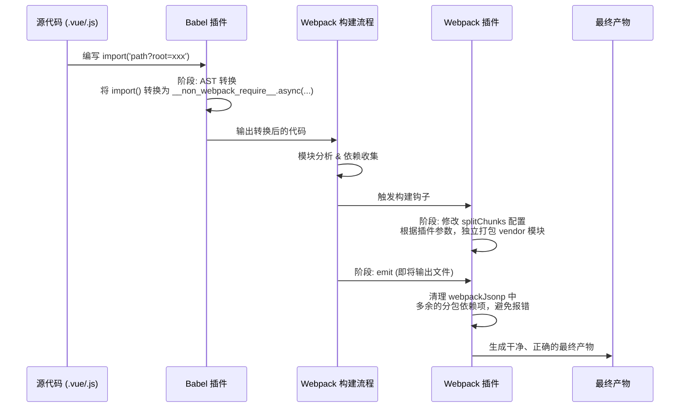

# uni-app 分包异步化插件 (uni-async-import)

[创作过程](https://juejin.cn/post/7520074335202885666)

[](https://www.npmjs.com/package/uni-app-async-subpackage-plugin)
[](LICENSE)

一个旨在 `uni-app` 框架中完美实现小程序“分包异步化”功能的 Webpack & Babel 插件组合。

## 背景痛点

`uni-app` 作为优秀的跨端框架，在小程序生态中被广泛使用。随着业务迭代，小程序主包体积超限成为常见问题。官方的“分包”方案虽然能解决代码体积问题，但带来了新的挑战：

当多个业务分包需要依赖一个**大型公共模块**（如直播、IM、视频播放器等 `vendor` 模块）时：

- 若将 `vendor` 放在主包，会拖慢主包加载速度，影响用户体验。
- 若将 `vendor` 分别打包进各个业务分包，会造成代码冗余和分包体积增大。

**“分包异步化”** 是微信小程序官方提供的最佳解决方案：将这个大型公共模块作为一个独立的分包，在进入需要它的业务分包时，**先异步加载 `vendor` 分包，成功后再加载业务分包**。

然而，`uni-app` 目前尚未原生支持此功能。本项目旨在通过工程化手段，为 `uni-app` 开发者带来原生般的分包异步化体验。

## ✨ 功能特性

- **主包瘦身**：将大型公共模块从主包中剥离，显著减小主包体积。
- **代码复用**：实现公共模块的按需加载和跨分包复用，避免代码冗余。
- **原生体验**：通过简单的 `import()` 语法即可实现分包的异步加载，对业务代码侵入极小。
- **稳定可靠**：方案基于 AST（抽象语法树）进行源码转换，不受代码压缩、混淆影响，在 `dev` 和 `build` 环境下均可稳定运行。
- **自动化**：通过插件组合自动完成代码转换、模块打包、依赖清理等一系列复杂操作。

## 🚀 快速上手

### 1. 配置分包 (pages.json)

确保你的 `pages.json` 中已配置好需要异步加载的业务分包和作为公共依赖的 `vendor` 分包。

**示例：**
假设 `subpackage` 是业务分包，`subpackage-vendor` 是其依赖的公共模块分包。

```json
{
  "pages": [
    // ...主包页面
  ],
  "subPackages": [
    {
      "root": "pages/subpackage",
      "pages": ["index/index"]
    },
    {
      // 这个分包专门用来存放 subpackage 的公共依赖
      "root": "pages/subpackage-vendor",
      "pages": ["index/index"]
    }
  ],
  "preloadRule": {
    //...
  }
}
```

### 2. 配置 vue.config.js

在 `vue.config.js` 文件，引入并配置 Webpack 插件。

```javascript
// vue.config.js

const AsyncImportPlugin = require('uni-async-import/webpack');
module.exports = {
  configureWebpack: {
    plugins: [
      new AsyncImportPlugin(['pages/subpackage-vendor/request', 'pages/subpackage-vendor/im-sdk']),
    ],
  },
};
```

**配置说明:**

- 在 `AsyncImportPlugin` 的构造函数中，传入一个数组，包含了所有需要被打包到 `vendor` 分包的模块路径。插件会根据这些路径自动创建 `splitChunks` 规则。

### 3. babel.config.js 配置babel插件

```js
// babel.config.js
const babelPluginAsyncWrapper = require('uni-async-import/babel/babel-plugin-async-wrapper');

module.exports = {
  plugins: [babelPluginAsyncWrapper],
};
```

### 4. 在业务代码中使用

现在，你可以在业务代码中（例如 `pages/subpackage/index/index.vue`）通过 `import()` 语法来异步加载你的模块了。

**关键点：** 必须在导入路径后添加 `?root=` 查询参数，其值为 `vendor` 模块所在的分包 `root`。

```javascript
// 在 pages/subpackage/index/index.vue 中
export default {
  onLoad() {
    console.log('开始加载异步分包...');

    // 使用动态 import() 并携带 ?root= 参数
    // 插件会自动将这行代码转换为分包异步化加载逻辑
    import('@/pages/subpackage-vendor/request.js?root=pages/subpackage-vendor')
      .then((res) => {
        console.log('异步模块加载成功!', res);
        res.getData(); // 调用模块导出的方法
      })
      .catch((err) => {
        console.error('异步模块加载失败', err);
      });
  },
};
```

编译后，插件会自动将上述代码转换为类似以下形式的、符合小程序分包异步化规范的代码：

```javascript
// 编译后产物（示意）
__non_webpack_require__.async('pages/subpackage-vendor/common/vendor.js').then(() => {
    return Promise.resolve(require('@/pages/subpackage-vendor/request.js'));
}).then(...)
```

## ⚙️ 实现原理

本方案的精髓在于“**在正确的时间做正确的事**”，通过 Babel 插件和 Webpack 插件的协同工作，实现了稳定而高效的自动化流程。



1.  **Babel 插件 (源码转换)**: 在 Webpack 对模块进行分析前，通过 `babel-loader` 介入。它解析源代码的 AST，精准找到 `import('path?root=xxx')` 语法，并将其转换为一个包含 `__non_webpack_require__.async()` 的函数调用。`__non_webpack_require__` 可以绕过 Webpack 的依赖分析，从而将加载时机完全交由小程序运行时处理。这个阶段的操作是健壮的，不受代码压缩和混淆的影响。

2.  **Webpack 插件 (打包与清理)**:
    - **修改 `splitChunks`**: 插件会读取配置，动态地向 Webpack 的 `optimization.splitChunks.cacheGroups` 中添加规则，确保指定的公共模块被打包成一个独立的 `vendor.js` 文件，并放置在对应的 `vendor` 分包目录下。
    - **清理 `emit` 产物**: Webpack 在构建时可能仍会错误地将分包的 `vendor` 记录为主包或业务分包的入口依赖。此插件会在 `emit` 阶段读取即将生成的文件内容，移除这些错误的依赖声明，确保小程序启动时不会因找不到文件而报错。

## 🤝 贡献

欢迎提交 PR 或 Issue，共同完善这个项目。

- [ ] 自动收集异步引入的文件
- [ ] 分包异步引入组件
- [ ] 分包异步化引入文件失败重试
